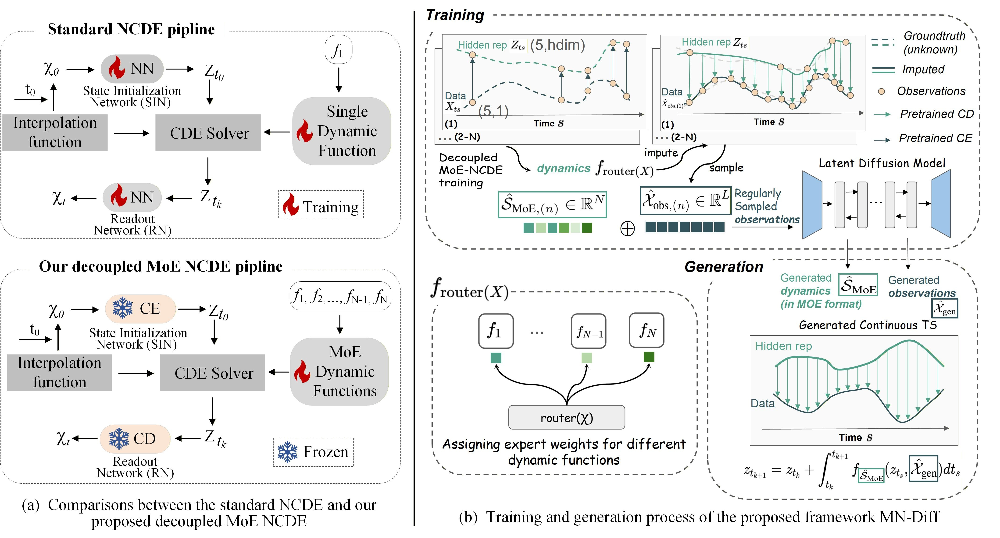

# Diff-MN: Diffusion Parameterized MoE-NCDE for Continuous Time Series Generation with Irregular Observations (ICML, 2026)
The paper is available at [[Paper]](https://arxiv.org/pdf/2601.13534).

## Motivation

Time series generation (TSG) is widely used across domains, yet most existing methods assume **regular sampling** and **fixed output resolutions**. These assumptions are often violated in practice, where observations are **irregular and sparse**, while downstream applications require **continuous and high-resolution** time series.

Although **Neural Controlled Differential Equation (NCDE)** is promising for modeling irregular time series, it is constrained by:

- a **single dynamics function**,
- **tightly coupled optimization**, and
- limited ability to adapt learned dynamics to **newly generated samples**.

---

## Proposed Method: Diff-MN

We propose **Diff-MN**, a continuous TSG framework that enhances NCDE with:

- a **Mixture-of-Experts (MoE)** dynamics function, and
- a **decoupled architecture** for dynamics-focused training.

To further enable NCDE to generalize to newly generated samples, Diff-MN employs a **diffusion model** to parameterize the NCDE temporal dynamics parameters (**MoE weights**), i.e., jointly learning:

- the distribution of **time-series data**, and
- the distribution of **MoE weights**.

This design allows **sample-specific NCDE parameters** to be generated for continuous time-series generation.

The overall model structure is shown in the following figure.


---

## Experimental Results

Experiments on **ten public and synthetic datasets** demonstrate that **Diff-MN consistently outperforms strong baselines** on both:

- **irregular-to-regular** TSG tasks, and
- **irregular-to-continuous** TSG tasks.


## Environment

Install the environment using the YAML file: `./environment_diffmn.yml`:

```bash
conda env create -f environment_diffmn.yml --force --no-deps
```

## Data
Stocks and Energy data are located in `./datasets`. Sine, MuJoCo, polynomial datasets are generated and the scripts are included in `./datasets` folder.

`utils_data.py` provides functions for loading data in both regular and irregular settings. In particular, irregular data are preprocessed using the Python class `TimeDataset_irregular`, which may take some time to run. Once preprocessing is complete, the processed data are saved in the `./datasets` directory for future use.


## Reproducing the paper results
By setting the time series length and missing values within the script, the results in the paper can be reproduced:


**Step 1:** The initial MoE NeuralCDE can be trained by `run_irregular_moencde.py`.

---

**Step 2:** Parameterizing the MoE weights can be achieved by jointly training the TS samples and their corresponding MoE weights through script `run_diffmn_diffsuion.py`.

---

**Step 3:** Through Step 2, we generate new samples along with their corresponding MoE weights. These weights are then fed into the pretrained MoE Neural CDE to perform continuous time series generation for each new sample. Finally, the refined high-frequency continuous time series are obtained using the script `run_irregular_moencde_continues.py`, providing richer temporal information and improving the accuracy of downstream tasks.


## Reference
```
@misc{zhang2026diffmndiffusionparameterizedmoencde,
      title={Diff-MN: Diffusion Parameterized MoE-NCDE for Continuous Time Series Generation with Irregular Observations}, 
      author={Xu Zhang and Junwei Deng and Chang Xu and Hao Li and Jiang Bian},
      year={2026},
      eprint={2601.13534},
      archivePrefix={arXiv},
      primaryClass={cs.LG},
      url={https://arxiv.org/abs/2601.13534}, 
}
```